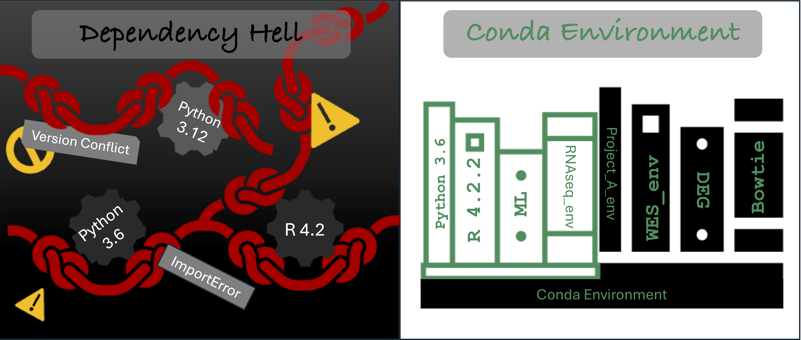

### Introduction to Conda

<!--- ## Dependency Hell vs Conda Environments   -->




Conda is an open-source package management system and environment management system. It is the single most important tool for ensuring that your bioinformatics pipelines run consistently, both on your local machine and on an HPC cluster.

### Installing Conda via Command Line

We describes how to install **Conda** (using **Miniconda**, recommended) across macOS, Linux, and Windows systems, and how to verify a successful installation.

---

### Why Miniconda?
Miniconda is a lightweight Conda distribution that includes only Conda and Python, allowing users to install only the packages they need. This is preferred for scientific computing and bioinformatics workflows.

---

### macOS and Linux Installation

### 1. Download the Installer
Use `curl` or `wget` to download the latest Miniconda installer from the official Anaconda repository.

> **Note:** Always check https://repo.anaconda.com/miniconda/ for the latest filename.

#### Linux Example
```
wget https://repo.anaconda.com/miniconda/Miniconda3-latest-Linux-x86_64.sh
```

#### macOS Example (Intel)
```
curl -O https://repo.anaconda.com/miniconda/Miniconda3-latest-MacOSX-x86_64.sh
```
#### macOS Example (Apple Silicon)
```
curl -O https://repo.anaconda.com/miniconda/Miniconda3-latest-MacOSX-arm64.sh
```
Execute the downloaded installer using `bash`:
`bash Miniconda3-latest-Linux-x86_64.sh`


** Follow the Installation Prompts **
- Press ENTER to review the license agreement.
- Type yes to accept the license.
- Accept the default installation location or specify a custom path.
- When prompted to initialize Conda, type yes.

### Window Installation

#### Windows Example

Download the installer:

https://www.anaconda.com/download/success


- Miniconda installer for Windows
- Anaconda Distribution installer for Windows
- Miniforge installer for Windows
- Verify your installer hashes.
- Double-click the .exe file.
- Follow the instructions on the screen.

If you are unsure about any setting, accept the defaults. You can change them later.

When installation is finished, from the Start menu, open either the Anaconda Command Prompt (cmd.exe) if using Miniconda or Anaconda Distribution, and the Miniforge Command Prompt if using Miniforge. Powershell prompts are also available.

- Test your installation. In your terminal window, run the command conda list. A list of installed packages appears if it has been installed correctly.
- To run the the Windows installer for Miniconda in silent mode, use the /S argument. The following optional arguments are supported:

`/InstallationType=[JustMe|AllUsers]---Default is JustMe.`

` /AddToPath=[0|1]---Default is 0 `

` /RegisterPython=[0|1] ` ---Make this the system's default Python. 0 indicates Python won't be registered as the system's default. 1 indicates Python will be registered as the system's default.

`/S `---Install in silent mode.

`/D=<installation path>` ---Destination installation path. Must be the last argument. Do not wrap in quotation marks. Required if you use `/S`.

---
## Creating Isolated Conda Environments (Python & R)

<!-- One of the biggest advantages of Conda is the ability to create **fully isolated environments** for different languages and workflows. -->
Below are two practical examples: one for a modern Python workflow and one for an R-based analysis.


## Example 1: Python Environment (Python 3.12)

This environment is suitable for data science, bioinformatics scripting, and general analysis workflows.

#### Create the environment

```bash
conda create -n py312_env python=3.12 -y
```
Activate the environment
`conda activate py312_env
`
Install commonly used Python packages
```
conda install -c conda-forge \
  numpy \
  pandas \
  scipy \
  matplotlib \
  seaborn \
  scikit-learn \
  jupyterlab \
  biopython -y
```

Verify installation
```
python --version
python -c "import numpy, pandas, biopython; print('Python environment ready')"
```

Typical use cases

- Data analysis and visualization
- Bioinformatics analysis (RNAseq, DEanalysis, PCA etc.)
- Machine learning experiments
- Jupyter notebooks


## Example 2: R Environment (R 4.2.2)

This environment is designed for statistical analysis, visualization, and reproducible research using R.

#### Create the environment
`conda create -n r422_env r-base=4.2.2 -y`

Activate the environment
`conda activate r422_env`

Install commonly used R packages
`conda install -c conda-forge \
  r-tidyverse \
  r-ggplot2 \
  r-dplyr \
  r-readr \
  r-tidyr \
  r-data.table \
  r-knitr \
  r-rmarkdown -y
`

Verify installation

`
R --version
R -q -e "library(tidyverse); cat('R environment ready\n')"
`

Typical use cases

- Statistical analysis
- Data visualization
- Report generation (R Markdown)
- Reproducible research workflows


---
Dive into official conda cheatsheet [ cheatsheet &rarr;](conda-cheatsheet.pdf)


---
Go back to introduction page [ Next Page &rarr;](README.md)
